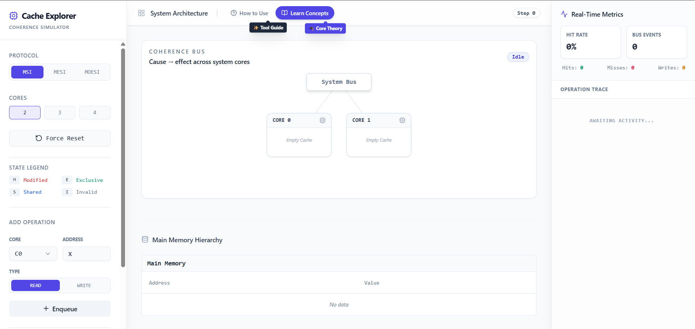

# ⚡ Cache Explorer 40: Cache Coherence Simulator

[](https://cache-coherence-simulator-pi.vercel.app/)

**[🌐 View Live Dashboard](https://cache-coherence-simulator-pi.vercel.app/)**

**Cache Explorer** is an advanced, highly interactive web-based simulator designed to visualize and teach the complex mechanics of **Cache Coherence Protocols** in multi-core processor architectures. 

Built with modern React and Tailwind CSS, this tool allows computer science students, hardware engineers, and developers to observe how hardware keeps memory synchronized across multiple independent CPU caches in real-time.

---

## 📸 Dashboard Overview



*The interactive visualization dashboard showing CPU cores, caches, the memory bus, and real-time execution logs.*

---

## 📖 In-Depth Project Overview

### What is Cache Coherence?
In modern multi-core processors, each CPU core has its own private, high-speed memory cache (L1/L2) to speed up execution. However, when multiple cores read and write to the same main memory address, they can end up with mismatched (incoherent) data. 

**Cache Coherence Protocols** are the "hardware rules" that CPUs use to communicate over a shared memory bus to ensure all cores see a consistent view of memory, invalidating or updating old data automatically.

### Why Cache Explorer?
Understanding these protocols from a textbook can be incredibly abstract and difficult. **Cache Explorer** bridges the gap between theory and practice by offering a fully visual, step-by-step simulation. You can see the exact states change, watch bus traffic animate, and understand exactly *why* a cache miss occurs or *why* an invalidation signal is sent.

It explicit breaks down the "magic" underlying multi-threaded applications.

---

## 🚀 Key Features

- **Interactive Visual Architecture:** Watch data and invalidation signals travel across the common data bus between CPU Cores and Main Memory in real-time.
- **Multiple Protocols Supported:** Dynamically switch the ruleset your CPU follows to compare efficiency and behavior:
  - **MSI (Modified, Shared, Invalid):** The fundamental baseline protocol.
  - **MESI (Modified, Exclusive, Shared, Invalid):** Adds the `Exclusive` state to reduce unnecessary bus invalidation traffic for clean data.
  - **MOESI (Modified, Owner, Exclusive, Shared, Invalid):** Adds the `Owner` state to allow cache-to-cache sharing of modified data, avoiding slow writes to main memory.
- **Predictive Prefetching (PPC):** Toggle advanced architectural features to see how hardware anticipates sequential memory reads and saves nanoseconds of latency.
- **Real-Time Metrics & Logs:** Track exact Hit Rates, Bus Events, Memory Writes, and microsecond-accurate operation traces.
- **Pre-built Scenarios:** Load built-in edge cases like "False Sharing", "Producer-Consumer", and "Sequential Read Patterns" to immediately understand complex failure states and hardware optimizations.
- **Integrated Learning:** Built-in "How to Use" and "In-Depth Learning" modules that act as a masterclass on Cache Coherence theory right alongside the simulator.

---

## 🛠️ Tech Stack

- **Frontend Framework:** [React 18](https://react.dev/)
- **Build Tool:** [Vite](https://vitejs.dev/) for lightning-fast HMR and building.
- **Language:** [TypeScript](https://www.typescriptlang.org/) for robust, type-safe simulation logic.
- **Styling:** [Tailwind CSS](https://tailwindcss.com/) for beautiful, responsive UI design.
- **UI Components:** [Radix UI](https://www.radix-ui.com/) primitives & [Lucide Icons](https://lucide.dev/).
- **Routing:** React Router DOM for seamless navigation between the simulator and educational pages.
- **Deployment:** Vercel

---

## 💻 Getting Started Locally

### Prerequisites

You need Node.js (version 18+ recommended) and npm installed on your machine.

### Installation

1. **Clone the repository:**
   ```bash
   git clone https://github.com/YourUsername/cache-explorer-40.git
   cd cache-explorer-40
   ```

2. **Install dependencies:**
   ```bash
   npm install
   ```

3. **Start the development server:**
   ```bash
   npm run dev
   ```

4. **Access the application:**
   Open your browser and navigate to `http://localhost:5173`

---

## 🕹️ How to Use the Simulator

1. **Configure Architecture:** On the left control panel, select your desired coherence protocol (e.g., MESI), the number of CPU cores, and toggle hardware prefetching.
2. **Queue Operations:** Add memory instructions (`READ` or `WRITE`) targeting specific Hex memory addresses (e.g., `0xA1`, `0xB2`) to the execution queue.
3. **Execute & Observe:** 
   - Click **"Step Next"** to execute one operation at a time and watch the slow-motion data animations.
   - Click **"Run All"** to instantly execute the entire queue and calculate the final results.
4. **Analyze Results:** Look at the visualizer in the center to see the new state blocks (`M`, `O`, `E`, `S`, `I`). Check the right-hand panel for your overall Cache Hit Rate, Bus Traffic metrics, and the detailed chronological transaction logs.

*💡 Pro Tip: If you aren't sure where to start, click the **"Load Scenario"** button in the bottom left, or click the glowing **"✨ Start Here!"** button at the top of the interface for a guided tour!*

---

## 🧠 Educational Value

By playing with the simulator, you will intuitively understand:
* **The Cost of Memory:** Why writing to main memory is exponentially slower than reading from an L1 cache.
* **Protocol Optimizations:** How the **Exclusive (E)** state in MESI saves massive amounts of bus bandwidth by recognizing when a core is the *only* one holding a piece of data.
* **Cache-to-Cache Transfers:** How the **Owner (O)** state in MOESI prevents the need to write modified data back to slow main memory before another core can read it.
* **False Sharing:** How multithreaded code that modifies independent variables residing on the same cache line destroys application performance by causing an endless storm of invalidation signals.

---

## 🤝 Contributing

Contributions, issues, and feature requests are welcome! 
If you want to add a new protocol (like the Dragon or Directory-based protocols) or a new hardware feature simulation:
1. Fork the Project
2. Create your Feature Branch (`git checkout -b feature/AmazingFeature`)
3. Commit your Changes (`git commit -m 'Add some AmazingFeature'`)
4. Push to the Branch (`git push origin feature/AmazingFeature`)
5. Open a Pull Request

---
*Architected and developed as a visual learning tool for modern Computer Architecture.*
